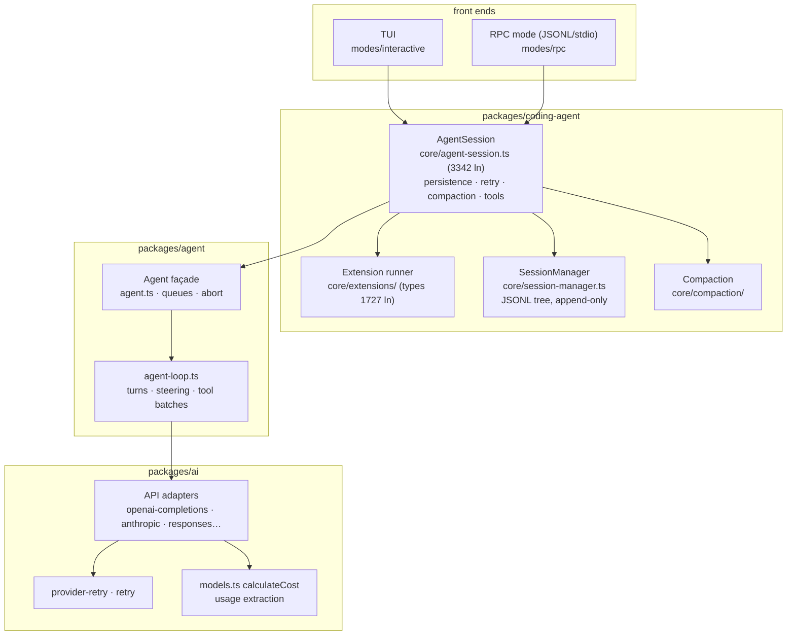
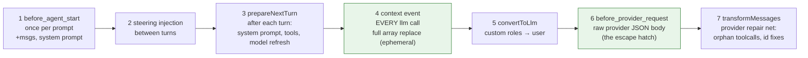
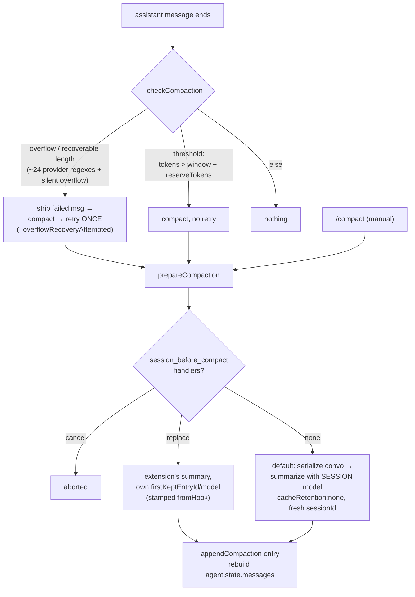

# Pi architecture — a field guide for context-economy work

A deep-dive map of the Pi coding agent (v0.84.0, upstream `earendil-works/pi`),
written for working on 10M-token-context models with no prompt caching
(Pokee-Isaac 28B), where **cost = turns × resident tokens**. Companion doc:
[LEVERS.md](LEVERS.md) — every knob classified as settings / extension / fork.

All `file:line` anchors refer to this repo's tree.

## The layers



- **`packages/ai`** — provider adapters, streaming, retries, usage/cost math.
- **`packages/agent`** — provider-agnostic turn loop and `Agent` façade.
- **`packages/coding-agent`** — everything user-visible: session persistence,
  extensions, compaction, retry policy, tools, TUI, RPC.
- `packages/agent/src/harness/` is a **newer parallel session abstraction**
  (with a SQLite backend in `packages/session-backends`) whose
  `compact()` is still `unavailable` — the coding-agent TUI does not use it.

## One turn, end to end

```mermaid
sequenceDiagram
    participant U as user / RPC
    participant S as AgentSession
    participant L as agent-loop
    participant X as extensions
    participant P as provider adapter (ai)
    U->>S: prompt()
    S->>X: input → before_agent_start (msgs +, system prompt override)
    S->>S: pre-send compaction check (agent-session.ts:1209)
    S->>L: agent.prompt()
    loop until no tool calls & queues empty
        L->>X: context event — transformContext (EVERY llm call)
        L->>L: convertToLlm
        L->>X: before_provider_request (raw JSON body)
        L->>P: stream (always SSE response; body buffered JSON)
        P-->>L: assistant msg + usage + cost
        L->>L: execute tool batch (parallel, results in call order)
        L->>X: tool_call / tool_result (gate, patch, rewrite)
        L->>L: inject steering between turns
    end
    L-->>S: settled
    S->>S: _handlePostAgentRun: retry? → _checkCompaction → queued msgs
    S->>X: agent_settled
```

Key properties:

- A "turn" = one LLM call + its tool batch (`agent-loop.ts:155-275`).
  Steering is injected between turns; follow-ups re-enter the outer loop.
- **Compaction only ever fires at turn boundaries** — post-run
  (`agent-session.ts:1098`) or pre-prompt (`:1207`), never mid-turn.
- `stopReason: "length"` fails the whole tool batch rather than executing
  possibly-truncated args (`agent-loop.ts:381`).
- Turn-level retry (`_prepareRetry`, default 3 attempts, exponential) re-sends
  the **full resident context each attempt** — a silent cost multiplier on an
  uncached model.

## The seven outbound interception points

Where the message array / request can be modified, in flight order. This is
the most important map in the repo for context-cost work:



- **#4 `context`** (`runner.ts:984-1014`): `structuredClone`d, chained across
  extensions, purely a per-request *view* — the session file and TUI never see
  the trim. This is where sliceofpi's whole L1 pipeline lives.
  ⚠️ Handler exceptions are **swallowed** (`runner.ts:1000-1010`): a crashed
  cost-control extension fails *open* into a full-context request.
- **#6 `before_provider_request`** (`sdk.ts:330-336`): hands you the raw
  provider JSON. Temperature, max_tokens, tool defs, cache breakpoints — all
  editable. Reaches things the settings system doesn't expose.
- **#7 repair net** (`transform-messages.ts:158-219`): synthesizes
  `"No result provided"` results for orphaned tool calls and drops
  error/aborted assistant messages — so a trimming stage that slips is
  repaired, not rejected.

Loop invariants a rewriter must respect: last message converts to
user/toolResult (`agent-loop.ts:74`); one toolResult per toolCall (repair net
backstops); no strict user/assistant alternation at loop level (adapters own
that); never mutate `context.messages` mid-stream (the in-flight partial is
`messages[last]`).

## Compaction



Facts that matter at 10M:

- The trigger is already **absolute headroom**, not percent:
  `contextTokens > contextWindow − reserveTokens` (`compaction.ts:235-238`).
  With `contextWindow: 10M` and default `reserveTokens: 16384` it fires at
  ~9.98M — effectively never. Percentages exist only in the footer meter
  (70%/90% colors, hardcoded).
- **`reserveTokens` does double duty**: trigger headroom *and* summary output
  budget (`maxTokens = 0.8 × reserveTokens`, `compaction.ts:637`). Setting it
  to 9.8M to compact at 200k also blows up the summary budget and makes the
  branch-summary input budget (`contextWindow − reserveTokens`) go negative.
  These must be split in a fork.
- Cut point walks back `keepRecentTokens` (default 20k, absolute — sane at
  any window) and snaps to a valid boundary, never inside a
  toolCall/toolResult pair.
- Summaries are **iterative summary-of-summary** (previous summary + new
  messages), so information decays monotonically across compactions. Tool
  results are truncated to 2000 chars before summarization (hardcoded).
- The summarizer is always the **session model** at full price —
  no `compaction.model` setting exists. It correctly sets
  `cacheRetention: "none"` + fresh sessionId (right for uncached models).
- Extension-supplied compactions are stamped `fromHook: true`, which
  **breaks read/modified file-list inheritance** for the next compaction
  (`compaction.ts:52`).
- Nothing is ever deleted: compaction is a view operation over the append-only
  JSONL tree; `buildSessionContext` skips the summarized range on replay.

## Session store

One JSONL file per session; every entry `{id, parentId, timestamp}` — a
**tree**, branched by moving `leafId`. Entry types: message,
compaction, branch_summary, custom (state only, not in context),
custom_message (in context), model/thinking changes, labels. Replay walks
leaf→root, applies the latest compaction's cut, and replays model/thinking
changes. Malformed lines are skipped silently.

## Cost & token accounting

- Usage is extracted per-adapter and cost computed inside `packages/ai`
  (`models.ts:878-898`, tiered pricing; whole-request tier selection). Cost is
  attached to the finished assistant message — **the transcript is the
  ledger**; there is no pre-flight "this request will cost $X" seam.
- `getContextUsage()` anchors on the last valid assistant usage and
  char-estimates (chars/4) only trailing messages. Note
  `calculateContextTokens` counts **output** tokens into "context" — fine as
  a compaction proxy, an overcount as a resident-token measure.
- `cache-stats.ts` is structurally cache-shaped: on a provider that never
  reports cacheRead/cacheWrite it reports **zero forever**
  (`cache-stats.ts:66`). The number a no-cache model needs — resident tokens
  re-billed every turn — is the *complement* of what it measures.
- Compaction, branch summaries, and turn retries all make full-context calls
  whose usage is recorded (bucketed "Tools/summaries") but never budgeted.

## Provider layer facts (openai-completions ≈ the Pokee path)

- **Responses always stream** (`stream: true` hardcoded); the **request body
  never streams** — it's one buffered `JSON.stringify` through the OpenAI SDK.
  No size checks, no chunking, no 45MiB awareness. The one built-in seam is
  `options.fetch` (plumbed into `new OpenAI({fetch})`).
- Timeouts: undici `headersTimeout`/`bodyTimeout` both = `httpIdleTimeoutMs`,
  **default 5 min** — shorter than a 10M-token prefill (~7 min). The settings
  parser accepts any number, so ≥600000 is settable even though the picker
  stops at 5 min. SDK-level `timeoutMs` must be raised too.
- Retries: SDK retries disabled; Pi's wrapper retries 408/409/429/5xx/network
  with Retry-After support capped at 60s (above that: immediate throw to the
  outer loop). **402 and 413 are never retried.** A timeout during a 7-min
  prefill has no status → *is* retried → replays the full multi-MiB body.
- Unknown 413 messages from a novel gateway won't match the ~24 overflow
  regexes → no auto-compaction, no retry, just an error (`overflow.ts`,
  fork point acknowledged in its own comments).
- With an unknown baseUrl, compat detection lands on the "standard OpenAI"
  bucket and **no cache fields are sent at all** — correct for Pokee.
- `maxTokens` is clamped to `contextWindow − estimatedContext − 4096` using
  the chars/4 estimate; at multi-M contexts the estimation error is large
  enough to matter.
- HTTP/2 is off (`allowH2: false`, hardcoded); keep-alive is undici default.

## What's built vs not

| Capability | Status |
|---|---|
| Per-request context rewrite | ✅ built (`context` event) |
| Raw request-body rewrite | ✅ built (`before_provider_request`) |
| Full compaction replacement | ✅ built (`session_before_compact`) |
| Custom providers incl. own `streamSimple` | ✅ built (`registerProvider`) |
| System-prompt replacement per turn | ✅ built (`before_agent_start`) |
| Tool gating / arg patching / result rewriting | ✅ built |
| RPC automation (prompt/steer/compact/stats/fork…) | ✅ built (31 commands) |
| Subagents / task tool | ❌ not in core — example extension spawns `pi` processes |
| Cost-aware compaction trigger | ❌ no seam (`shouldCompact` is private + pure headroom) |
| Pre-flight request cost estimate | ❌ no seam |
| Per-call model override (model B for one request) | ❌ session-wide only |
| Request-body streaming / size awareness | ❌ nothing |
| Extension retry/timeout/budget control | ❌ settings-only |
| No-cache re-billing metric | ❌ `cache-stats` measures the opposite |

The full knob-by-knob classification with file anchors:
**[LEVERS.md](LEVERS.md)**.
